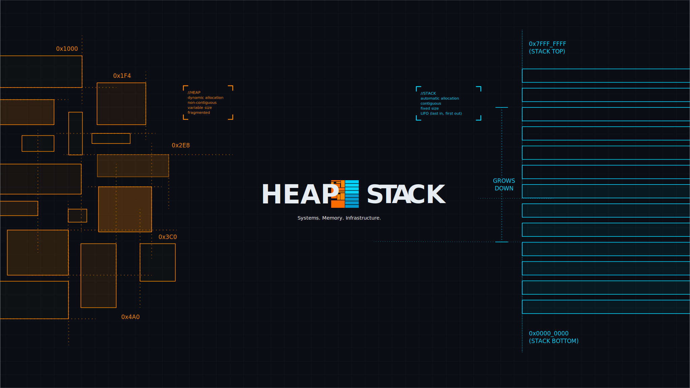

**Heap & Stack** — understanding systems through failure.

Most developer content teaches syntax, APIs, frameworks, tools. We teach tradeoffs, constraints, failure, and systems thinking — not "how," but "why" and "what happens next."

```
████████████████
    ████████
       ████
```

---

### What's here

- **`website`** — the source for [heapandstack.dev](https://heapandstack.dev), built with Astro
- **`code-autopsy-bot`** — the bot behind [Request for Code Autopsy](https://heapandstack.dev/postmortems/submit), our reader-submission pipeline for real engineering failures

### Elsewhere

- Writing → [dev.to/heapandstack](https://dev.to/heapandstack)
- Video → [YouTube](https://youtube.com/@heapandstack)
- Connect → [X](https://x.com/heap_and_stack)
- Discussion → [Discord](#)
- Newsletter → [heapandstack.dev/newsletter](#)

### Got a failure worth writing up?

[Request for Code Autopsy](#) is always open — named or anonymous, your choice.

---

*Understanding systems through failure.*
